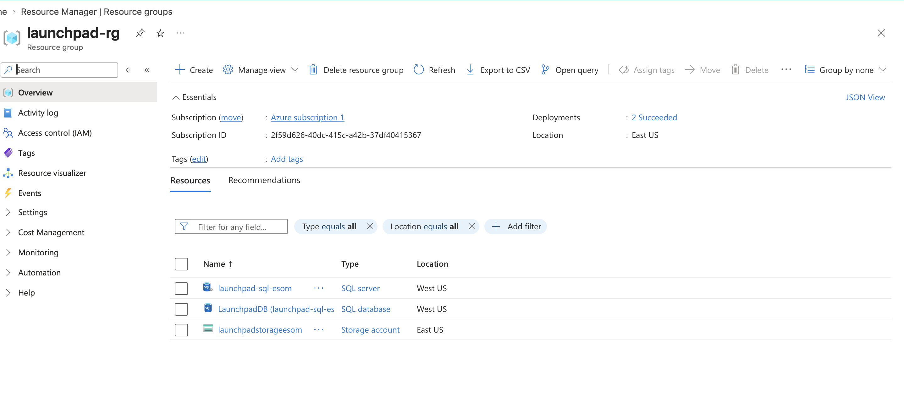
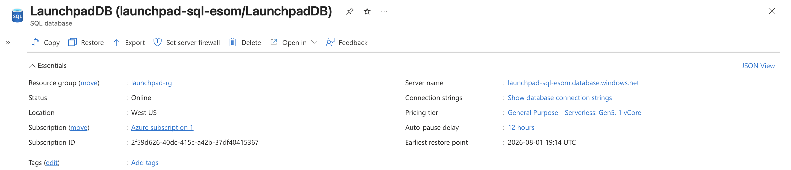
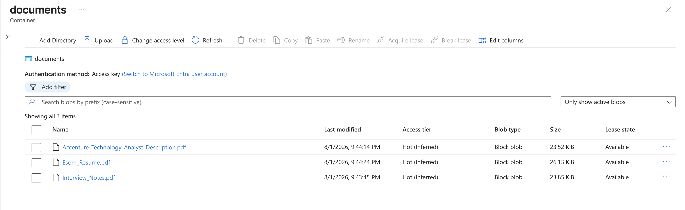
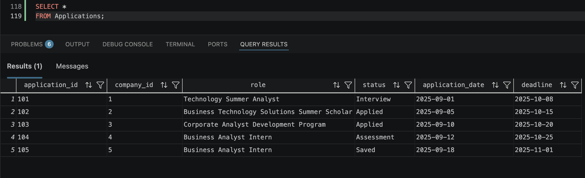

# Launchpad Cloud Recruiting Platform

## Overview

Launchpad is a cloud-based recruiting management platform that centralizes internship and job application tracking using Microsoft Azure services. The project demonstrates how organizations can organize structured recruiting data, securely store documents, and maintain a scalable cloud architecture.

This project was built to explore how cloud technologies can improve business workflows commonly managed through spreadsheets and disconnected files.

---

## Business Problem

Students often manage internship recruiting with spreadsheets, folders, and notes spread across multiple applications. This makes it difficult to:

- Track application progress
- Organize resumes and job descriptions
- Prepare for interviews
- Monitor application deadlines

Launchpad provides a centralized cloud solution that stores recruiting information in Azure SQL Database while managing supporting documents in Azure Blob Storage.

---

## Solution Architecture

The platform uses Microsoft Azure services to separate structured data storage from document storage.

```text
User
 |
 v
Azure SQL Database
 |
 | Stores document metadata and Blob URLs
 |
 v
Azure Blob Storage

Azure SQL Database stores structured recruiting information:

- Companies
- Applications
- Interviews
- Skills
- Documents metadata

Azure Blob Storage stores:

- Resume PDFs
- Job descriptions
- Interview notes
  
---

## Azure Services Used

| Service | Purpose |
|----------|---------|
| Azure SQL Database | Stores structured recruiting data |
| Azure Blob Storage | Stores recruiting documents |
| Azure Resource Group | Organize cloud resources |

---

## Database Design

The relational database consists of six normalized tables:

- Companies
- Applications
- Interviews
- Documents
- Skills
- ApplicationSkills

Relationships were normalized to reduce redundancy and improve maintainability.

---

## Features

- Track internship applications
- Store company information
- Record interview details
- Organize recruiting documents
- Map required skills to applications
- Execute SQL queries for recruiting analytics

---

## Sample SQL Queries

Examples include:

- Applications by status
- Upcoming deadlines
- Required skills by company
- Interview history
- Company application summary

---

## Project Structure

```

```markdown
```text
launchpad-cloud-recruiting-platform/

├── database/
│   ├── schema.sql
│   ├── sample_data.sql
│   └── queries.sql

├── docs/
│   ├── business_problem.md
│   ├── requirements.md
│   └── database_design.md

├── images/
│   ├── resource-group.png
│   ├── azure-sql-database.png
│   ├── blob-storage.png
│   └── sql-query-results.png

└── README.md
```
```


```

---

## Project Screenshots

### Azure Resource Group

Azure resources deployed for the Launchpad platform.



---

### Azure SQL Database

Azure SQL Database hosting the Launchpad relational database.



---

### Azure Blob Storage

Blob Storage container used to store recruiting documents.



---

### SQL Query Results

Example query showing recruiting application data stored in Azure SQL Database.



---

## Future Improvements

Potential enhancements include:

- Build a web interface for managing applications
- Add Microsoft Entra ID authentication
- Create analytics dashboards for recruiting insights
- Add automated deadline notifications

---

## Technologies

- Microsoft Azure
- Azure SQL Database
- Azure Blob Storage
- SQL
- Visual Studio Code
- Git
- GitHub

---

## Author

Esom Nwachukwu
